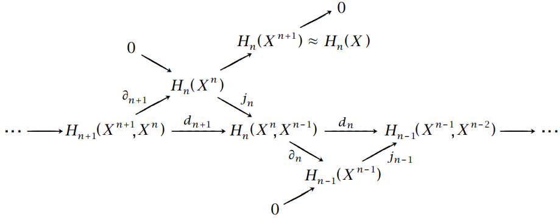

## 第一节课

* 集合 $X$ 被称为**拓扑空间**，如果存在集族 $\tau\subset2^X$ 满足：
  * $X,\emptyset\in\tau$.
  * $\tau$ 中任意个集合之并属于 $\tau$.
  * $\tau$ 中有限个集合之交属于 $\tau$.

  这样的集族 $\tau$ 称为 $X$ 上的一个**拓扑**，$\tau$ 中的集合称为**开集**。

* 设 $\tau$ 是 $X$ 上的拓扑，$Y\subset{X}$，则 $\tau\vert_Y=\{U\cap{Y}\vert{U}\in\tau\}$ 是 $Y$ 上的拓扑。

* 定义在拓扑空间上的函数 $f:X\to{Y}$ 称为是**连续**的，如果开集在 $f$ 作用下的原象总是开集。

## 第二节课
* 设 $A\subset{X}$，点 $p\in{X}$ 称为 $A$ 的**极限点**，如果 $p$ 的任意邻域与 $A-\{p\}$ 交集非空。

> $X=\mathbb{C}$ 上的 Zariski 拓扑：$A\subset{X}$ 是开集当且仅当 $A$ 的补集是有限集或 $X$。
> 在 Zariski 拓扑下，$A$ 是闭集 $\iff$ $A$ 是有限集或 $X$ $\iff$ $A$ 是某个多项式的零点集合。
> 在 Zariski 拓扑下，$|A|$ 有限 $\Longrightarrow$ $A$ 没有极限点，$A$ 无限 $\Longrightarrow$ $X$ 中的点都是 $A$ 的极限点。

* 称集合 $A$ 是**闭集**，如果其补集 $X\backslash{A}$ 是开集。$A$ 是闭集 $\iff$ $A$ 包含 $A$ 的所有极限点。

* 集合 $A$ 与其极限点集合之并 $\overline{A}$ 称为 $A$ 的**闭包**。$\overline{A}$ 是包含 $A$ 的最小闭集。
  * 推论：$A$ 是闭集 $\iff$ $A=\overline{A}$.

* 集合 $A\subset{X}$ 称为是**稠密**的，如果 $\overline{A}=X$。

* $x\in{A}$ 称为集合 $A$ 的**内点**，如果存在 $x$ 的邻域 $U\subset{A}$。

* $x\in{X}$ 称为集合 $A$ 的**边界点**，如果 $x$ 既不是 $A$ 的内点也不是 $X\backslash{A}$ 的内点。

* 设集族 $\beta$ 包含 $X$ 的一些开子集。若 $X$ 中的每个开集都是 $\beta$ 中集合之并，则称 $\beta$ 是 $X$ 的**拓扑基**。

* 设 $\beta\subset2^X$ 非空，若有以下条件成立：
  * $\bigcup_{A\in\beta}A=X$.
  * 任意$B_1,B_2\in\beta$ 和 $x\in B_1\cap B_2$，存在 $B_3\in\beta$ 使得 $x\in B_3\subset B_1\cap B_2$.
  
  则 $\beta$ 中任意数量集合之并全体构成 $X$ 上的一个拓扑。

* 设 $f:X\to{Y}$ 和 $g:Y\to{Z}$ 都是连续映射，则 $g\circ f:X\to{Z}$ 也是连续的。

* 设 $f:X\to{Y}$ 连续，$A\subset{X}$ 具备子空间拓扑 $\tau\vert_A$，则 $f\vert_A:A\to{Y}$ 也是连续的。

* 关于拓扑空间上的连续映射，以下几条等价：
  1. $f:X\to{Y}$ 是连续的.
  2. 若 $\beta$ 是 $Y$ 的一个拓扑基，则 $\beta$ 中集合的原象是开集.
  3. 对任意 $A\subset{X}$，有 $f(\overline{A})\subset\overline{f(A)}$.
  4. 对任意 $B\subset{Y}$，有 $\overline{f^{-1}(B)}\subset{f^{-1}}(\overline{B})$.
  5. 对任意闭集 $B\subset{Y}$，$f^{-1}(B)$ 是 $X$ 中的闭集.
  > $1\Longrightarrow2$：显然，因为拓扑基中只有开集。
  > $2\Longrightarrow3$：$f(A)\subset\overline{f(A)}$ 显然。设 $x\in\overline{A}\backslash{A}$ 但 $f(x)\notin{f}(A)$，任取 $f(x)$ 的邻域 $U$，存在拓扑基中的集合 $B$ 满足 $f(x)\in{B}\subset{U}$。而根据 $2$，$f^{-1}(B)$ 是 $X$ 中的开集，从而是 $x$ 的邻域。注意 $x$ 是 $A$ 的极限点，因此 $f^{-1}(B)$ 与 $A$ 交集非空，也即 $B$ 和 $f(A)$ 交集非空。 进一步地，$U$ 与 $f(A)$ 交集非空，从而 $f(x)$ 是 $f(A)$ 的极限点，满足 $f(x)\in \overline{f(A)}$。
  > $3\Longrightarrow4$：在 $3$ 中令 $A=f^{-1}(B)$ 即有 $f[\overline{f^{-1}(B)}]\subset\overline{B}$，从而 $\overline{f^{-1}(B)}\subset{f^{-1}}(\overline{B})$。
  > $4\Longrightarrow5$：根据 $4$，$\overline{f^{-1}(B)}\subset{f^{-1}}(\overline{B})=f^{-1}(B)$，因此 $f^{-1}(B)$ 也是闭集。
  > $5\Longrightarrow1$：根据开闭集的关系显然。

* 连续映射 $f:X\to{Y}$ 称为**同胚**，如果存在连续的 $g:Y\to{X}$ 满足 $f\circ{g}=\text{id}_Y$ 和 $g\circ{f}=\text{id}_X$。
  > 一般情况下，连续双射 $f:X\to Y$ 不一定是同胚。

## 第三节课
* **连续的局部性**
  * $f:X\to Y$ 是连续的，如果 $X$ 可以被一族开集 $\{U_\alpha\}$ 覆盖，且 $f$ 限制在每个 $U_\alpha$ 上都连续.
  * $f:X\to Y$ 是连续的，如果 $X$ 可以被有限个闭集 $\{F_i\}$ 覆盖，且 $f$ 限制在每个 $F_i$ 上都连续.

* 设 $\beta\subset2^X$ 非空，若满足以下两条，则称 $\beta$ 是 $X$ 的一组**基**：
  1. $\beta$ 中任意集合非空.
  2. 任取 $B_1,B_2\in\beta$，存在 $B_3\in\beta$，使得 $B_3\subset B_1\cap B_2$.

* 设映射 $f:X\to{Y}$，其中集合 $X$ 有一组基 $\beta$，集合 $Y$ 是拓扑空间。点 $p\in{Y}$ 称为 $f$ 在 $\beta$ 上的**极限**，如果对 $p$ 的任意邻域 $V$，都存在 $A\in\beta$ 使得 $f(A)\subset{V}$。符号表示为 $\lim_\beta{f(x)}=p$。

* 设 $d$ 是集合 $X$ 上的一个度量，子集 $A\subset{X}$。对任意 $x\in{X}$，定义 $d(x,A)=\inf_{a\in{A}}d(x,a)$。
  > 固定集合 $A$，映射 $x\to{d}(x,A)$ 是连续的。

* 设闭集 $A,B\subset{X}$ 不交，则存在连续映射 $f:X\to\mathbb{R}$ 满足 $f\vert_{A}=1$，$f\vert_B=-1$，且在 $A\cup{B}$ 以外的其他点上 $f(x)\in(-1,1)$。
  > 构造 $f(x)=\dfrac{d(x,B)-d(x,A)}{d(x,B)+d(x,A)}$ 即可。注意对于闭集 $A$，有 $x\in{A}\iff{d}(x,A)=0$。

* **Tietze 扩张定理**：设 $X$ 是度量空间，闭集 $C\subset{X}$。如果映射 $f:C\to\mathbb{R}$ 连续，则 $f$ 可以连续地扩张成 $X$ 上的连续映射。

* 称序列 $\{x_n\}$ 为**柯西列**，若任给 $\epsilon>0$，都存在 $N$ 使得 $d(x_m,x_n)<\epsilon$ 对所有 $m,n>N$ 成立。

* 称序列 $\{x_n\}$ **收敛**到 $a\in{X}$，如果 $\lim_{n\to\infty}d(x_n,a)=0$。 点 $a$ 称为 $\{x_n\}$ 的**极限**。

* 度量空间 $(X,d)$ 称为是**完备**的，如果 $X$ 中每个柯西列都收敛到 $X$ 中某点。
  > 在通常的欧氏度量下，$\mathbb{R}$ 是完备的，而 $\mathbb{Q}$ 不是完备的。
  > $C[a,b]$ 在度量 $d(f,g)=\int_{a}^{b}\vert f(x)-g(x)\vert\text{d}x$ 下不是完备的。
  > $C[a,b]$ 在度量 $d(f,g)=\max_{x\in[a,b]}\vert f(x)-g(x)\vert$ 下是完备的。

## 第四节课
* 设 $(X,d)$ 是完备度量空间 $(Y,d)$ 的子空间，并且 $\overline{X}=Y$，则称 $(Y,d)$ 是 $(X,d)$ 的**完备化**。

* 称度量空间 $(X_1,d_1)$ 和 $(X_2,d_2)$ **等距同构**，若存在双射 $f:X_1\to{X_2}$，使得对任意 $a,b\in{X_1}$ 都有 $d_1(a,b)=d_2[f(a),f(b)]$。这样的 $f$ 也称为**等距同构映射**。

* 设 $(X,d)$ 是度量空间，则对任意 $a,b,u,v\in{X}$ 有 $\vert d(a,b)-d(u,v)\vert\le d(a,u)+d(b,v)$。

* **完备化的唯一性**：设 $(Y_1,d_1)$ 和 $(Y_2,d_2)$ 都是 $(X,d)$ 的完备化，则它们等距同构。

* **完备化的存在性**：在等距同构意义下，每个度量空间都存在完备化。
  > 大致证明思路可参考这个[知乎专栏](https://zhuanlan.zhihu.com/p/87443659)。

* 拓扑空间 $X$ 称为是**紧空间**，如果 $X$ 的每个开覆盖都存在有限子覆盖。

* 子集 $A\subset{X}$ 称为是**紧集**，如果 $A$ 在相应的子空间拓扑下是紧空间。

* 设 $f:X\to{Y}$ 连续，若 $X$ 是紧空间，则 $f(X)$ 是 $Y$ 的紧子集。

* 子集 $X\subset{\mathbb{R}}^n$ 是紧集当且仅当 $X$ 是有界闭集。

## 第五节课
* 拓扑空间 $X$ 称为是 **Hausdorff 空间**，若 $X$ 中任意两个不同的点都存在不交的邻域。
  > 容易发现，所有度量空间都是 Hausdorff 空间。
  > 但赋以 Zariski 拓扑的 $\mathbb{C}$ 不是 Hausdorff 空间。

* 设 $f:X\to{Y}$，其中 $Y$ 是 Hausdorff 空间，则对 $X$ 的任一组基 $\beta$，$\lim_{\beta}f(x)$ 若存在必唯一。

* **紧集和闭集的关系**：Hausdorff 空间的紧子集是闭集，紧空间的闭子集是紧集。

* 设 $f:X\to{Y}$ 是连续双射，其中 $X$ 是紧空间，$Y$ 是 Hausdorff 空间，则 $f$ 是同胚。

* 设 $X$ 是紧空间，$A\subset{X}$ 是无限子集，则 $A$ 一定有极限点。

* 设 $f:X\to\mathbb{R}$ 连续，若 $X$ 是紧空间，则 $f$ 有界且可以取到边界值。

* **勒贝格引理**：设 $X$ 是紧的度量空间，$\{U_\alpha\}$ 是 $X$ 的一个开覆盖，则存在 $\delta>0$，使得 $X$ 的任意直径小于 $\delta$ 的子集都包含在某个 $U_\alpha$ 中。这样的 $\delta$ 称为 $\{U_\alpha\}$ 的一个勒贝格数。
  > 对于度量空间 $(X,d)$ 的子集 $A$，其**直径**定义为 $\sup_{x_1,x_2\in{A}}d(x_1,x_2)$。

* 设 $X,Y$ 是拓扑空间，我们称在 $X\times{Y}$ 上定义的、以 $\beta=\{U\times{V}\vert{U}\in\tau_X,V\in\tau_Y\}$ 为拓扑基的拓扑为 $X,Y$ 的**乘积拓扑**，对应的 $X\times{Y}$ 称为**乘积空间**。

* 对于乘积空间 $X\times{Y}$，我们称映射 $P_1(x,y)=x$ 和 $P_2(x,y)=y$ 为**投影映射**。

* 乘积拓扑是使得投影映射为连续映射的最小拓扑（满足这一条件的拓扑必包含乘积拓扑）。

* $f:Z\to{X}\times{Y}$ 连续 $\iff$ $P_1\circ{f}:Z\to{X}$ 和 $P_2\circ{f}:Z\to{Y}$ 都连续。

* 设 $X$ 和 $Y$ 非空，则 $X\times{Y}$ 是 Hausdorff 空间 $\iff$ $X$ 和 $Y$ 都是 Hausdorff 空间。

## 第六节课
* 设 $\beta$ 是 $X$ 的一组拓扑基，则 $X$ 是紧的 $\iff$ 任意 $\beta$ 中集合构成的 $X$ 的开覆盖都存在有限子覆盖。

* $X\times{Y}$ （在乘积拓扑意义下）是紧的 $\iff$ $X$ 和 $Y$ 都是紧的。

* 空间 $X$ 称为是**连通**的，如果非空集合 $A,B$ 满足 $A\cup{B}=X$ $\Longrightarrow$ $\overline{A}\cap{B}$ 和 $A\cap\overline{B}$ 不全为空。

* 关于连通性，以下几条等价：
  1. $X$ 是连通的.
  2. $X$ 的既开又闭子集只有 $X$ 和 $\emptyset$.
  3. $X$ 不能表示为两个不交非空开集的并.

* 设 $f:X\to{Y}$ 连续，则 $X$ 连通 $\Longrightarrow$ $f(X)$ 连通。

* 设 $X$ 是拓扑空间，$Z$ 是 $X$ 的稠密子集，则 $Z$ 连通 $\Longrightarrow$ $X$ 连通。
  > 推论：设 $Z\subset{X}$ 连通，$Z\subset{Y}\subset\overline{Z}$，则 $Y$ 连通。特别地，我们有 $\overline{Z}$ 连通。

* $X$ 是 $\mathbb{R}$ 中非平凡的连通集 $\iff$ $X$ 是区间。

## 第七节课
* 称 $A,B\subset{X}$ 是**相互分离**的，如果 $\overline{A}\cap\overline{B}=\emptyset$。

* 设 $X=\bigcup_{\alpha}A_\alpha$，若每个 $A_\alpha$ 都连通，且不存在相互分离的一对 $A_\alpha$，则 $X$ 连通。
  > 推论：设 $X=\bigcup_{\alpha}A_\alpha$，若每个 $A_\alpha$ 都连通，且 $\bigcap_\alpha{A_\alpha}\not=\emptyset$，则 $X$ 连通。

* 设 $X,Y$ 非空，则 $X\times{Y}$ 连通 $\iff$ $X$ 和 $Y$ 都连通。

* 在 $X$ 上定义关系：$x\sim{y}$ $\iff$ 存在连通的 $A\subset{X}$ 满足 $x,y\in{A}$。则 $\sim$ 是等价关系，且由 $\sim$ 导出的等价类称为 $X$ 的**连通分支**。

* 连通分支一定是闭集，且不同连通分支之间一定相互分离。
  > 推论：若 $X$ 只有有限个连通分支，则每个连通分支都是既开又闭的。

* 连续映射 $\gamma:[0,1]\to{X}$ 称为拓扑空间 $X$ 的一条**道路**，$\gamma(0)$ 和 $\gamma(1)$ 称为这条道路的**起点**和**终点**。

* 拓扑空间 $X$ 称为是**道路连通**的，如果 $X$ 中任意两点都可以用一条道路连接。

* **道路连通的空间是连通的**。$\mathbb{R}^n$ 的连通开子集是道路连通的。

* 在 $X$ 上定义关系：$x\sim{y}$ $\iff$ 存在一条道路 $\gamma$ 连接 $x$ 和 $y$。则 $\sim$ 是等价关系，且由 $\sim$ 导出的等价类称为 $X$ 的**道路连通分支**。

## 第八节课
* 设 $X$ 是拓扑空间，$X=\bigcup_{i\in{I}}P_i$ 为其一个分划，其中每个 $P_i$ 都非空。记 $Y=\{P_i\,|\,i\in{I}\}$，定义 $\pi:X\to{Y}$ 为 $\pi(x)=P_j$，如果 $x\in{P_j}$，并在 $Y$ 上定义拓扑：$U$ 是开集当且仅当 $\pi^{-1}(U)$ 是 $X$ 中的开集。则称该拓扑为 $Y$ 上的**黏合拓扑**，$Y$ 称为对应于分划 $X=\bigcup_{i\in{I}}P_i$ 的**黏合空间**。

* 设 $Y$ 是 $X$ 的一个黏合空间，$Z$ 是拓扑空间，则 $f:Y\to{Z}$ 连续 $\iff$ $f\circ{\pi}:X\to{Z}$ 连续。

* 设 $f:X\to{Y}$ 是连续的满射，如果 $U\subset{Y}$ 是开集 $\iff$ $f^{-1}(U)$ 是开集，则称 $f$ 为**黏合映射**。

* 设 $f:X\to{Y}$ 是连续的满射，如果 $f$ 将开集（闭集）映射为开集（闭集），则 $f$ 是黏合映射。

* 设 $f:X\to{Y}$ 是连续的满射，如果 $X$ 是紧空间且 $Y$ 是 Hausdorff 空间，则 $f$ 是黏合映射。

* **连续局部性的推广**：设 $X=\bigcup_{\alpha\in{I}}X_\alpha$，定义不交并 $\widetilde{X}=\bigsqcup_{\alpha\in{I}}X_\alpha$，并在其上装备拓扑：$U\subset\widetilde{X}$ 是开集 $\iff$ 对每个 $\alpha$，$U\cap{X_\alpha}$ 是 $X_\alpha$ 中的开集。又令 $j:\widetilde{X}\to{X}$ 满足 $j|_{X_\alpha}$ 是 $X_\alpha$ 到 $X$ 的嵌入，则当 $j$ 是黏合映射时，只要 $f:X\to{Y}$ 限制在每个 $X_\alpha$ 上都连续，就有 $f$ 连续。

* **射影空间** $\mathbb{R}\text{P}^n$ 的三种构造方法：
  1. 取 $n$ 维单位球面 $S^n\subset\mathbb{R}^{n+1}$，将 $S^n$ 的对径点黏合，即可得到射影空间 $\mathbb{R}\text{P}^n$.
  2. 将 $\mathbb{R}^{n+1}\backslash\{0\}$ 中位于同一条过原点直线上的所有点黏合，即可得到射影空间 $\mathbb{R}\text{P}^n$.
  3. 取 $n$ 维单位球 $B^n\subset\mathbb{R}^n$，仅将其边界 $S^{n-1}$ 的对径点黏合，即可得到射影空间 $\mathbb{R}\text{P}^n$.
  > 第二种构造方法实际上取的是 $\mathbb{R}^{n+1}$ 的所有一维线性子空间，因此可以很容易地进行推广。

## 第九节课
* 设 $X$ 是拓扑空间，$I=[0,1]$，令 $CX=X\times{I}/X\times\{1\}$，即将 $X\times\{1\}$ 黏合成一个点，所得的黏合空间 $CX$ 称为一个**锥**。

* 设 $X$ 是拓扑空间，$I=[0,1]$，在空间 $X\times{I}$ 中将 $X\times\{0\}$ 黏合成一个点，$X\times\{1\}$ 黏合成另一个点，所得的黏合空间 $SX$ 称为一个**双角锥**。

* 设 $X,Y$ 是拓扑空间，在 $X\sqcup{Y}$ 中黏合 $x_0\in{X}$ 和 $y_0\in{Y}$，所得的 $X\vee{Y}$ 称为一个**楔和**。

* 设子空间 $A\subset{Y}$，$f:A\to{X}$ 连续，在 $X\sqcup{Y}$ 中黏合所有 $a\in{A}$ 和 $f(a)\in{X}$，所得的黏合空间记作 $X\cup_{f}Y$，这样的 $f$ 称为一个**贴映射**。

* 设 $f:{X}\to{Y}$ 连续，在 $CX$ 中利用贴映射 $f$ 将 $X\times\{0\}$ 粘到 $Y$ 上，所得的黏合空间 $Y\cup_{f}CX$ 称为一个**映射锥**。

* 一个**拓扑群**是指使得乘法运算和求逆运算都连续的 Hausdorff 空间。
  > 容易验证，拓扑群的子群在子空间拓扑下也是拓扑群。

* 设 $G_1,G_2$ 是拓扑群，映射 $f:G_1\to{G_2}$ 称为是**同构**，如果 $f$ 同时是同胚和群同构。

* 设 $G$ 是拓扑群，$x\in{G}$，映射 $L_x:g\in{G}\to{xg}\in G$ 称为一个**左平移**。可以验证，$L_x$ 同时是同胚和群同构。类似也可以定义**右平移** $R_x:g\in{G}\to{gx}\in{G}$。

* 设 $G$ 是拓扑群，$K$ 是包含 $G$ 中单位元 $e$ 的连通分支，则 $K$ 是 $G$ 的闭正规子群。

* 设 $G$ 是连通的拓扑群，则 $G$ 中单位元 $e$ 的任意邻域都构成了 $G$ 的一个生成元集合。

* 一般线性群 $\text{GL}(n;\mathbb{R})$ 在 $\mathbb{R}^{n^2}$ 的欧氏拓扑下构成拓扑群。
  > $\text{GL}(n;\mathbb{R})$ 是 $\mathbb{R}^{n^2}$ 的开子集，并且不连通（行列式符号不同的矩阵各自构成一个连通分支）。

* 特殊线性群 $\text{SL}(n;\mathbb{R})\subset\text{GL}(n;\mathbb{R})$ 不是紧的，但是连通的。

* 正交矩阵群 $\text{O}(n)$ 和 特殊正交矩阵群 $\text{SO}(n)$ 都是紧的。

* 设 $G$ 是拓扑群，$X$ 是拓扑空间，称 $f:{G}\times{X}\to{X}$ 为 $G$ 到 $X$ 的**作用**，如果 $f$ 是群作用且连续。
  > 可以验证，对每个 $g\in{G}$，映射 $x\to{gx}$ 都是同胚。

## 第十节课
* 设拓扑群 $G\curvearrowright{X}$，在 $X$ 上定义等价关系：$x\sim{y}$ $\iff$ 存在 $g\in{G}$ 满足 $x=gy$，则 $\sim$ 给出了 $X$ 的一个分划，称为 $X$ 的 **G-轨道**，该分划对应的黏合空间 $X/G$ 称为**商空间**或**轨道空间**。

* $\mathbb{R}\text{P}^n$ 中的两点 $x,y$ 称为是**齐次**的，如果存在 $\lambda\not=0$ 满足 $x=\lambda{y}$。将齐次的点视为等同，定义集合$U_i=\{(x_1,\cdots,x_{n+1})\in\mathbb{R}\text{P}^n|x_i\not=0\}$，则 $U_i$ 是 $\mathbb{R}\text{P}^n$ 中的开集且同胚于 $\mathbb{R}^n$。
  > 容易发现，集族 $\{U_i|i=1,\cdots,n+1\}$ 给出了 $\mathbb{R}\text{P}^n$ 的一个开覆盖。
  > 类似的操作也可以对 $\mathbb{C}\text{P}^n$ 进行，得到一族同胚于 $\mathbb{C}^n$ 的开集，构成 $\mathbb{C}\text{P}^n$ 的开覆盖。

* 设拓扑群 $G\curvearrowright{X}$，则自然映射 $\pi:X\to{X}/G$ 是开映射（将开集映射为开集）。

* 设拓扑群 $G\curvearrowright{X}$，若 $G$ 和 $X/G$ 都连通，则 $X$ 连通。
  > 推论：$\text{SO}(n)$ 是连通的，因为 $\text{SO}(n+1)/\text{SO}(n)\cong{S}^{n}$。

## 第十一节课
* 设 $f,g:X\to{Y}$ 连续，称 $f$ 与 $g$ **同伦**，如果存在连续的 $F:X\times{I}\to{Y}$ 满足 $F(x,0)=f(x)$ 且 $F(x,1)=g(x)$。这里 $I=[0,1]$ 为单位闭区间。
  > 形如 $F(x,t)=(1-t)f(x)+tg(x)$ 的 $F$ 称为**直线同伦**。

* 设 $f,g:X\to{Y}$ 连续，称 $f$ 与 $g$ **相对于 $A\subset{X}$ 同伦**，如果 $f\vert_A=g\vert_A$，并且上述定义中的 $F$ 进一步满足 $F(x,t)=f(x)=g(x)$ 对所有 $x\in{A}$，$t\in{I}$ 成立。

* 设 $f,g:X\to{Y}$ 相对于 $A$ 同伦，$h:Y\to{Z}$ 连续，则 $h\circ{f}$ 与 $h\circ{g}$ 相对于 $A$ 同伦。

* 设 $g,h:Y\to{Z}$ 相对于 $B$ 同伦，$f:X\to{Y}$ 连续，则 $g\circ{f}$ 与 $h\circ{f}$ 相对于 $f^{-1}(B)$ 同伦。

* 道路 $\gamma:I\to{X}$ 称为是**环路**，如果 $\gamma(0)=\gamma(1)$。固定 $p\in{X}$，考虑所有满足 $\gamma(0)=\gamma(1)=p$ 的环路，它们在相对于 $\{0,1\}\subset{I}$ 的同伦下划分成若干等价类，这些等价类称为**同伦类**。

* 上述所有同伦类的集合在适当的乘法运算下构成群，称为 $X$ 的基点为 $p$ 的**基本群**，记作 $\pi_1(X,p)$。
  > 乘法的定义详见 **Armstrong** 书第 $5.2$ 节。
  > 若将环路定义中的 $I$ 换成 $S^n$，最终得到的基本群就记作 $\pi_n(X,p)$。

## 第十二节课
* 设 $X$ 是道路连通的，则对任意 $p,q\in{X}$ 有 $\pi_1(X,p)$ 与 $\pi_1(X,q)$ 同构，该同构类记作 $\pi_1(X)$。

* 设 $f:X\to{Y}$ 连续，则 $f$ 诱导了一个由 $\pi_1(X)$ 到 $\pi_1(Y)$ 的自然映射 $f_*:$ $\langle\alpha\rangle$ $\mapsto$ $\langle{f}\circ\alpha\rangle$。
  > 这样定义的 $f_*$ 是群同态，满足 $(g\circ{f})_*=g_*\circ{f}_*$ 和 $(\text{id}_X)_*=\text{id}_{\pi_1(X)}$。

* 设 $f:X\to{Y}$ 是同胚，则相应的 $f_*$ 是 $\pi_1(X)$ 与 $\pi_1(Y)$ 之间的群同构。
  > 推论：基本群不相同的拓扑空间一定不同胚。

* 称道路连通空间 $X$ 是**单连通**的，如果 $\pi_1(X)=\{e\}$。
  > 显然欧氏空间的凸子集都是单连通的。

* $\pi_1(S^1)$ 同构于整数集 $\mathbb{Z}$。
  > 证明见 **Armstrong** 书第 $5.3$ 节。

## 第十三节课
* **Brouwer 不动点定理**：设 $B$ 是任意维度的球，$f:B\to{B}$ 连续，则存在 $x\in{B}$ 满足 $f(x)=x$。
  > 一维情况，$B=[-1,1]$，易证结论成立。
  > 二维情况，反设 $f(x)\not=x$ 恒成立，则对每个 $x\in{B}$，将 $f(x)$ 连接到 $x$ 并延长至边界，得到一点 $g(x)\in{S}^1$。这样定义的 $g(x)$ 是连续映射，且限制在 $S^1$ 上是恒等映射。记 $i$ 为 $S^1$ 到 $B$ 的嵌入，则 $g\circ{i}=\text{id}_{S^1}$，从而 $g_*\circ{i}_*=\text{id}_{\pi_1(S^1)}$，这表明 $g_*$ 是满射。但 $g_*$ 的定义域 $\pi_1(B)$ 是平凡群，而值域 $\pi_1(S^1)$ 非平凡，显然矛盾。

* 设 $U,V$ 是 $X$ 的开子集且 $X=U\cup{V}$，若 $U,V$ 单连通且 $U\cap{V}$ 道路连通，则 $X$ 单连通。
  > 推论：$S^n(n\ge2)$ 是单连通的，从而基本群是平凡群。

* 设 $X,Y$ 道路连通，则 $\pi_1(X\times{Y})$ 同构于 $\pi_1(X)\times\pi_1(Y)$。

* 称拓扑空间 $X,Y$ **同伦等价**，如果存在连续的 $f:X\to{Y}$ 和 $g:Y\to{X}$ 满足 $g\circ{f}$ 同伦于 $\text{id}_{X}$，$f\circ{g}$ 同伦于 $\text{id}_Y$。这样的 $f,g$ 称为一对**同伦逆**。
  > 同伦等价是等价关系，其条件弱于同胚。

* 设 $A\subset{X}$，若连续映射 $F:X\times{I}\to{X}$ 满足 $F(x,0)=x$，$F(x,1)\in{A}$，且当 $x\in{A}$ 时恒有 $F(x,t)=x$，则称 $F$ 为从 $X$ 到 $A$ 的一个**形变收缩**。
  > 若存在这样的 $F$，则 $X$ 与 $A$ 同伦等价（可取 $f=F\vert_{t=1}$，$g$ 为 $A$ 到 $X$ 的嵌入）。

* 空间 $X$ 称为是**可缩**的，如果 $\text{id}_X$ 与某点 $p\in{X}$ 处的常数映射同伦。
  > 欧氏空间的凸子集都是可缩的（取直线同伦即可）。

## 第十四节课
* 设 $f\underset{F}{\simeq}g:X\to{Y}$，则对 $\alpha\in\pi_1(X,p)$ 有 $g\circ\alpha\simeq\gamma^{-1}\cdot(f\circ\alpha)\cdot\gamma$，其中 $\gamma(t)=F(p,t)$。

* 设 $X,Y$ 同伦等价，则 $\pi_1(X)\cong\pi_1(Y)$。
  > 推论：如果存在从 $X$ 到 $A$ 的形变收缩，则 $\pi_1(X)\cong\pi_1(A)$。
  > 推论：如果 $X$ 是可缩的，则 $\pi_1(X)$ 是平凡的。

* 关于可缩性，以下几条成立：
  1. $X$ 是可缩的 $\iff$ $X\simeq\{p\}$.
  2. 设 $f,g:X\to{Y}$，若 $Y$ 可缩，则 $f\simeq{g}$.
  3. 若 $X$ 可缩，则 $\text{id}_X$ 同伦于任意 $p\in{X}$ 处的常数映射.
  > 关于第 $3$ 点注意，即使 $X$ 是可缩的，也可能不存在 $X$ 到 $\{p\}$ 的形变收缩（要求相对同伦）。

* $G_1*{G}_2$ 上的**自由积**：将元素写成 $g_1g_2\cdots{g_n}$ 的形式，其中每个 $g_i\in{G_1}\cup{G_2}$。对其进行约化操作（去除恒等元，合并相邻的同属于 $G_1$ 或 $G_2$ 的元），则全体约化后的元素在乘法下构成群。

* 无限多个群的自由积：设 $I$ 为指标集，$\mathrm{\large *}_{\alpha\in{I}}G_\alpha$ 定义为全体长度有限且约化后的元素集合。
  > 若每个 $G_\alpha\cong\mathbb{Z}$，则它们的自由积也称为**自由群**。

* 自由积的**泛性质**：对任意 $\alpha$，定义 $i_\alpha$ 为 $G_\alpha$ 到 $\mathrm{\large *}_{\alpha\in{I}}G_\alpha$ 的自然嵌入。若存在一族 $\{\phi_\alpha\}$，其中每个 $\phi_\alpha:G_\alpha\to{H}$ 都是同态，则存在唯一的同态 $\phi:\mathrm{\large *}_{\alpha\in{I}}G_\alpha\to{H}$ 满足 $\phi\circ{i_\alpha}=\phi_\alpha$。
  > 定义 $\phi(g_1\cdots{g}_n)=\phi_{\alpha_1}(g_1)\cdots\phi_{\alpha_n}(g_n)$ 即可，其中 $g_i\in{G}_{\alpha_i}$。

* **van Kampen 定理**：设 $X=\bigcup_{\alpha\in{I}}A_\alpha$，其中每个 $A_\alpha$ 都是道路连通的开集，$\bigcap_{\alpha\in{I}}A_\alpha$ 非空，且对任意 $\alpha,\beta\in{I}$，交集 $A_{\alpha}\cap{A}_{\beta}$ 也道路连通。对每个 $\alpha$，定义 $\phi_\alpha:\pi_1(A_\alpha)\to\pi_1(X)$ 为 $A_\alpha$ 到 $X$ 的嵌入所诱导的群同态，则由泛性质得到的 $\phi:\mathrm{\large *}_{\alpha\in{I}}\pi_1(A_\alpha)\to\pi_1(X)$ 是满射。
进一步，设对任意 $\alpha,\beta,\gamma\in{I}$，$A_\alpha\cap{A}_\beta\cap{A}_\gamma$ 仍道路连通。令 $i_{\alpha\beta}:\pi_1(A_\alpha\cap{A}_\beta)\to\pi_1(A_\alpha)$ 为 $A_\alpha\cap{A}_\beta$ 到 $A_\alpha$ 的嵌入所诱导的群同态，则上述同态 $\phi$ 的核 $N$ 是由全体形如 $i_{\alpha\beta}(w)i_{\beta\alpha}(w)^{-1}$ 的元素所生成的正规子群，即有群同构 $\pi_1(X)\cong\mathrm{\large *}_{\alpha\in{I}}\pi_1(A_\alpha)/N$。

## 第十五节课
* 设 $X=\bigvee_{\alpha}X_{\alpha}$ 是通过黏合点 $x_\alpha\in{X}_\alpha$ 得到的空间。若对每个 $\alpha$，都存在 $x_\alpha$ 的邻域 $U_\alpha\subset{X_\alpha}$，使得存在 $U_\alpha$ 到 $x_\alpha$ 的形变收缩，则 $\pi_1(X)\cong\mathrm{\large *}_{\alpha}\pi_1(X_\alpha)$。

* 环面的基本群是 $\mathbb{Z}\times\mathbb{Z}$，克莱因瓶的基本群是 $\langle{a},b|aba^{-1}b=e\rangle$，$\mathbb{R}\text{P}^2$ 的基本群是 $\mathbb{Z}/2\mathbb{Z}$。

## 第十六节课
* $X$ 的一个**覆叠空间**是指满足如下条件的空间 $\widetilde{X}$：存在 $p:\widetilde{X}\to{X}$ 和 $X$ 的一个开覆盖 $\{U_\alpha\}$，使得任意 $p^{-1}(U_\alpha)$ 都是 $\widetilde{X}$ 中一些开集的不交并，且 $p$ 限制在这些开集上都是同胚。$p$ 也称为**覆叠映射**。

* **道路提升引理**：设 $p:\widetilde{X}\to{X}$ 是覆叠映射，$\gamma:I\to{X}$ 为一条道路，起点 $\gamma(0)=x$。若 $\widetilde{x}_0\in\widetilde{X}$ 满足 $p(\widetilde{x}_0)=x$，则存在唯一的道路 $\widetilde{\gamma}:I\to\widetilde{X}$ 使得 $\widetilde{\gamma}(0)=\widetilde{x}_0$ 且 $p\circ\widetilde{\gamma}=\gamma$。

* **同伦提升引理**：设 $p:\widetilde{X}\to{X}$ 是覆叠映射，$F:Y\times{I}\to{X}$ 连续。若连续映射 $\widetilde{f}:Y\to\widetilde{X}$ 满足 $p\circ\widetilde{f}(y)=F(y,0)$，则存在唯一的 $\widetilde{F}:Y\times{I}\to\widetilde{X}$ 使得 $\widetilde{F}(y,0)=\widetilde{f}(y)$ 且 $p\circ\widetilde{F}=F$。

* 设 $p:\widetilde{X}\to{X}$ 是覆叠映射且 $p(\widetilde{x}_0)=x_0$，则 $p_*:\pi_1(\widetilde{X},\widetilde{x}_0)\to\pi_1(X,x_0)$ 总是单射。又设环路 $\langle{\alpha}\rangle\in\pi_1(X,x_0)$，则 $\langle{\alpha}\rangle$ 在 $p_*$ 下有原象 $\iff$ $\langle{\alpha}\rangle$ 的提升是以 $\widetilde{x}_0$ 为起点的环路。

* 设 $p:\widetilde{X}\to{X}$ 是覆叠映射且 $\widetilde{X}$ 与 $X$ 道路连通，则 $p$ 的层数 $\big|p^{-1}(x)\big|$ 恰为 $H=p_*(\pi_1(\widetilde{X},\widetilde{x}_0))$ 作为子群在 $\pi_1(X,x_0)$ 中的指数。
  > 对于连通空间 $X$，$\big|p^{-1}(x)\big|$ 对任意 $x\in{X}$ 都是常数，因此层数是良定义的。

## 第十八节课
* **提升的存在性**：设 $p:(\widetilde{X},\widetilde{x}_0)\to(X,x_0)$ 是覆叠映射，$f:Y\to{X}$ 满足 $f(y_0)=x_0$，其中 $Y$ 是道路连通且局部道路连通的，则 $f$ 存在提升 $\widetilde{f}$ $\iff$ $f_*\big[\pi_1(Y,y_0)\big]\subset{p}_*\big[\pi_1(\widetilde{X},\widetilde{x}_0)\big]$。
  > **局部道路连通**是指，对任意 $x$ 和邻域 $U_x$，都存在道路连通的开集 $V_x$，满足 $x\in{V_x}\subset{U_x}$。

* **提升的唯一性**：设 $p:\widetilde{X}\to{X}$ 是覆叠映射，$f:Y\to{X}$，其中 $Y$ 连通。若 $\widetilde{f}_1,\widetilde{f}_2:Y\to\widetilde{X}$ 都是 $f$ 的提升，且存在 $y_0\in{Y}$ 满足 $\widetilde{f}_1(y_0)=\widetilde{f}_2(y_0)$，则 $\widetilde{f}_1=\widetilde{f}_2$。

* 设 $p:\widetilde{X}\to{X}$ 是覆叠映射，若 $\pi_1(\widetilde{X})=\{e\}$，则称 $\widetilde{X}$ 为 **万有覆叠空间**，$p$ 为**万有覆叠映射**。

* $X$ 称为是**半局部单连通**的，如果对任意 $x\in{X}$，都存在邻域 $U_x$ 满足 $i_*\big[\pi_1(U_x,x)\big]=\{e\}$，其中 $i$ 是 $U_x$ 到 $X$ 的自然嵌入。

* 设 $p:\widetilde{X}\to{X}$ 是万有覆叠映射，则 $X$ 是半局部单连通的。

* 设 $X$ 道路连通、局部道路连通、半局部单连通，则存在万有覆叠映射 $p:\widetilde{X}\to{X}$。

## 第十九节课
* 设 $X$ 道路连通、局部道路连通、半局部单连通，则对任意子群 $H\subset\pi_1(X,x_0)$，都存在覆叠映射 $p:X_H\to{X}$ 满足 $p_*(\pi_1(X_H,\widetilde{x}_0))=H$，其中 $\widetilde{x}_0\in{p}^{-1}(x_0)$。

* 称覆叠映射 $p_1:\widetilde{X}_1\to{X}$ 与 $p_2:\widetilde{X}_2\to{X}$ **同构**，如果存在同胚 $f:\widetilde{X}_1\to\widetilde{X}_2$ 满足 $p_1=p_2{f}$。

* 设 $X$ 道路连通且局部道路连通，则两个道路连通的覆叠空间 $p_1:\widetilde{X}_1\to{X}$ 与 $p_2:\widetilde{X}_2\to{X}$ 保基点同构（$f(\widetilde{x}_1)=\widetilde{x}_2$） $\iff$ $p_{1*}(\pi_1(\widetilde{X}_1,\widetilde{x}_1))=p_{2*}(\pi_1(\widetilde{X}_2,\widetilde{x}_2))$。

* **覆叠空间分类定理**：设 $X$ 道路连通、局部道路连通、半局部单连通，则以下两条成立：
  1. $X$ 的全体道路连通覆叠空间在保基点同构意义下与 $\pi_1(X,x_0)$ 的子群一一对应。
  2. $X$ 的全体道路连通覆叠空间在同构意义下与 $\pi_1(X,x_0)$ 子群的共轭类一一对应。

* 设 $p:\widetilde{X}\to{X}$ 是覆叠映射，我们称 $\widetilde{X}$ 的一个自同构为 **deck 变换**。全体 deck 变换构成群 $G(\widetilde{X})$，从而有群作用 $G(\widetilde{X})\curvearrowright\widetilde{X}:f\cdot\widetilde{x}=f(\widetilde{x})$。
  > 由提升的唯一性，若 $\widetilde{X}$ 道路连通，且在某个点处 $f\cdot\widetilde{x}_0=\widetilde{x}_0$，则必有 $f=\text{id}_{\widetilde{X}}$。

* 覆叠空间 $p:\widetilde{X}\to{X}$ 称为是**正规**的，如果对任意 $x\in{X}$ 和 $x$ 的提升 $\widetilde{x}_1,\widetilde{x}_2$，都存在某个 deck 变换将 $\widetilde{x}_1$ 映射到 $\widetilde{x}_2$，即 $G(\widetilde{X})$ 在 $p^{-1}(x)$ 上的作用是传递的。

## 第二十节课
* 设 $X$ 道路连通且局部道路连通，$p:\widetilde{X}\to{X}$ 是道路连通的覆叠空间。记 $H=p_*(\pi_1(\widetilde{X},\widetilde{x}_0))$。
  1. $p$ 是正规的 $\iff$ $H$ 是 $\pi_1(X,x_0)$ 的正规子群.
  2. 设 $N(H)$ 是 $H$ 的正规化子，则 $G(\widetilde{X})\cong{N}(H)/H$.
  > 若 $p$ 是正规的，则 $G(\widetilde{X})\cong\pi_1(X,x_0)/H$。
  > 若 $p$ 是万有覆叠映射，则 $G(\widetilde{X})\cong\pi_1(X,x_0)$。

* 设 $G$ 是拓扑群，$Y$ 是拓扑空间，考虑群作用 $G\curvearrowright{Y}$。若对任意 $y\in{Y}$，都存在邻域 $U$，使得对任意 $g_1\not=g_2\in{G}$，都有 $g_1(U)\cap{g}_2(U)=\emptyset$，则称该群作用满足条件 $(*)$。
  > 由 deck 变换构成的群作用 $G(\widetilde{X})\curvearrowright\widetilde{X}$ 满足条件 $(*)$。

* 设群作用 $G\curvearrowright{Y}$ 满足条件 $(*)$，则以下几条成立：
  1. 商映射 $p:Y\to{Y}/G$ 是正规的覆叠映射.
  2. 若 $Y$ 道路连通，则 $G$ 是映射 $p$ 对应的 deck 变换集合.
  3. 若 $Y$ 道路连通且局部道路连通，则 $G\cong\pi_1(Y/G)/p_*(\pi_1(Y))$.

* 实射影平面 $\mathbb{R}\text{P}^n$ $(n\ge2)$ 的基本群都是 $\mathbb{Z}/2\mathbb{Z}$。

* 设点 $v_0,\ldots,v_n\in\mathbb{R}^m$ 满足 $v_1-v_0,\ldots,v_n-v_0$ 线性无关，即不落在某个 $n-1$ 维超平面上，则称这些点的凸包 $[v_0,\ldots,v_n]=\{\sum_{i=0}^{n}\lambda_iv_i\;|\;\sum_i{\lambda_i}=1\}$ 为 **$n$ 维单形**，顶点序为 $v_0,\ldots,v_n$。
  > 基本单形 $\Delta^n=\{(t_0,\ldots,t_n)\in\mathbb{R}^{n+1}\;|\;\sum_{i}t_i=1,\;t_i\ge0\}$。

* 对任意 $n$ 维单形 $[v_0,\ldots,v_n]$，有自然同胚 $h:\Delta^n\to[v_0,\ldots,v_n]$，$h(t_0,\ldots,t_n)=\sum_{i}t_iv_i$。
  > $t_0,\ldots,t_n$ 称为点 $\sum_{i}t_iv_i\in[v_0,\ldots,v_n]$ 的**质心坐标**。

* $n$ 维单形 $[v_0,\ldots,v_n]$ 的**面**是指 $\{v_0,\ldots,v_n\}$ 的非空子集生成的子单形。
  > 单形的顶点序自然诱导了所有面的顶点序。

* 拓扑空间 $X$ 的**奇异 $n$ 维单形**是指连续映射 $\sigma:\Delta^n\to{X}$。

## 第二十一节课
* 群 $C_n(X)=\{\sum_{i=1}^{m}n_i\sigma_i\;|\;m\in\mathbb{N},\;n_i\in\mathbb{Z},\;\sigma_i:\Delta^n\to{X}\}$ 称为**链群**，其中元素称为 **$n$ 链**。定义映射 $\partial_n:C_n(X)\to{C}_{n-1}(X)$ 为 $\partial_n(\sigma)=\sum_{i=0}^{n}(-1)^i\sigma|_{[v_0,\ldots,\hat{v}_i,\ldots,v_n]}$，这里 $\hat{v}_i$ 表示去掉顶点 $v_i$。将 $\partial_n$ 线性延拓到整个 $C_n(X)$，我们得到一个 $C_n(X)$ 到 $C_{n-1}(X)$ 的群同态，称为**边界同态**。

* $\partial_{n-1}\circ\partial_n:C_{n}(X)\to{C}_{n-2}(X)$ 恒等于 $0$。
  > 由此立即推出 $\text{Im}(\partial_{n+1})\subset\text{ker}(\partial_n)$。

* 设 $X$ 是拓扑空间，群 $H_n(X)=\text{ker}(\partial_n)/\text{Im}(\partial_{n+1})$ 称为 $X$ 的 **$n$ 维同调群**。$\text{ker}(\partial_n)$ 中的元素称为**闭链**。$\text{Im}(\partial_{n+1})$ 中的元素称为**边缘链**。称两个闭链 $a,b$ **同调**，如果 $a-b$ 是边缘链。
  > 一般地，如果有一列阿贝尔群 $\cdots\to{C_{n+1}}\to{C}_n\to{C}_{n-1}\to\cdots$ 和同态 $\partial_n:C_n\to{C}_{n-1}$，满足 $\partial_{n-1}\circ\partial_n=0$，则称此序列为**链复形**。类似定义的 $H_n$ 称为该链复形的 $n$ 维同调群。

* 设 $X$ 是单点空间，则 $H_n(X)=\begin{cases}\mathbb{Z} & n=0 \\ 0 & n > 0\end{cases}$

* 设 $\{X_\alpha\}_{\alpha\in{I}}$ 是 $X$ 的道路连通分支，则 $H_n(X)=\bigoplus_{\alpha\in{I}}H_n(X_\alpha)$。

* 设 $X$ 非空且道路连通，则 $H_0(X)=\mathbb{Z}$。
  > 结合上一条可知，对于一般的 $X$，有 $H_0(X)=\bigoplus_{\alpha\in{I}}\mathbb{Z}$。

* 考虑链复形 $\cdots{\to}C_2(X)\overset{\partial_2}{\to}C_1(X)\overset{\partial_1}{\to}C_0(X)\overset{\epsilon}{\to}\mathbb{Z}\to0$，其中 $\epsilon$ 是满同态，则该链复形的同调群 $\widetilde{H}_n(X)$ 称为 $X$ 的**约化同调群**，满足 $H_n(X)=\begin{cases}\widetilde{H}_n(X)\oplus\mathbb{Z} & n=0 \\ \widetilde{H}_n(X) & n > 0\end{cases}$

* 设 $f:X\to{Y}$ 连续，则 $X$ 上的奇异 $n$ 维单形 $\sigma$ 可以自然映射到 $Y$ 上的奇异 $n$ 维单形 $f\circ\sigma$。记这个映射为 $f_\#$，则 $f_\#$ 可以线性延拓为 $C_n(X)$ 到 $C_n(Y)$ 的同态，满足 $f_\#\circ\partial=\partial\circ{f}_\#$。
  > $f_\#$ 保持闭链和边缘链，从而诱导了 $H_n(X)$ 到 $H_n(Y)$ 的同态 $f_*$，满足 $f_*([\alpha])=[f_\#(\alpha)]$。
  > $(f\circ{g})_*=f_*\circ{g}_*$，$(\text{id}_X)_*=\text{id}_{H_n(X)}$。

* 设 $f,g:X\to{Y}$ 同伦，则 $f_*=g_*$。

## 第二十二节课
* 设 $f:X\to{Y}$ 是同伦等价，则 $f_*:H_n(X)\to{H}_n(Y)$ 是群同构。

* 考虑一列阿贝尔群的同态 $A.=(\cdots{\to}A_{n+1}\overset{f_{n+1}}{\to}A_n\overset{f_n}{\to}A_{n-1}\overset{f_{n-1}}{\to}\cdots)$。称该序列在 $A_n$ 处**正合**，如果 $\text{ker}(f_n)=\text{Im}(f_{n+1})$。称该序列**正合**，若该序列在所有$A_n$处均正合。
  > 正合序列 $0\to{A}\overset{f}{\to}B\overset{g}{\to}C\to0$ 称为**短正合列**，其中 $f$ 必为单射，$g$ 必为满射。

* 序列 $0.\to{A.}\overset{f.}{\to}B.\overset{g.}{\to}C.\to0.$ 称为**链复形的短正合列**，如果 $A.,B.,C.$ 都是链复形，$f.,g.$ 是相应的链映射，且满足所有 $0\to{A_n}\overset{f_n}{\to}B_n\overset{g_n}{\to}C_n\to0$ 都是短正合列。

* 给定链复形的短正合列 $0.\to{A.}\overset{f.}{\to}B.\overset{g.}{\to}C.\to0.$，定义**边界映射** $\partial:H_n(C.)\to{H}_{n-1}(A.)$ 如下：设 $c\in{C}_n$ 是闭链，选取 $b\in{B_n}$ 满足 $g_n(b)=c$。注意 $g_{n-1}\circ\partial_n(b)=\partial_n\circ{g}_n(b)=0$，因此 $\partial_n(b)\in\text{ker}(g_{n-1})=\text{Im}(f_{n-1})$。设 $a\in{A}_n$ 满足 $f_{n-1}(a)=\partial_n(b)$，我们令 $\partial([c])=[a]$。
  > 可以证明 $\partial$ 是良定义的，并且是群同态。

* 记号同上，序列 $\cdots\to{H}_{n+1}(C.)\overset{\partial}{\to}H_n(A.)\overset{f_*}{\to}H_n(B.)\overset{g_*}{\to}H_n(C.)\to\cdots$ 也是正合的，称为**同调长正合列**。

## 第二十三节课
* 设 $X$ 是拓扑空间，子集 $A\subset{X}$。令 $C_n(X,A)=C_n(X)/C_n(A)$，则序列 $\{C_n(X,A)\}$ 在链复形 $\{C_n(X)\}$ 的边界同态 $\partial$ 诱导下也构成链复形，对应的同调群 $H_n(X,A)$ 称为**相对同调群**。
  > $H_n(X,A)$ 中的代表元称为**相对闭链**：$\alpha\in{C_n(X)}$，满足 $\partial\alpha\in{C}_{n-1}(A)$。
  > $H_n(X,A)$ 中的单位元称为**相对边缘链**：$\alpha=\partial\beta+\gamma$，其中 $\beta\in{C}_{n+1}(X)$，$\gamma\in{C}_n(A)$。

* 记 $i$ 为嵌入映射，$j$ 为商映射，我们有短正合列 $0\to{C}_n(A)\overset{i}{\to}C_n(X)\overset{j}{\to}C_n(X,A)\to0$。
  > 由此可以构造相应的同调长正合列（更多讨论见 **Hatcher** 书第 $117$-$118$ 页）。

* 设 $f:(X,A)\to(Y,B)$，则 $f$ 诱导了 $f_\#:C_n(X,A)\to{C_n(X,B)}$ 以及相应的 $f_*$。

* 设 $f,g:(X,A)\to(Y,B)$ 关于 $F$ 同伦，且 $F|_{A\times{I}}\subset{B}$，则它们诱导的 $f_*$ 和 $g_*$ 相等。

* **切除定理**：设 $Z\subset{A}\subset{X}$ 满足 $\overline{Z}\subset\text{Int}(A)$，则自然嵌入 $(X-Z,A-Z)\to(X,A)$ 诱导了 $H_n(X-Z,A-Z)$ 到 $H_n(X,A)$ 的同构。
  > 等价地，设 $A,B\subset{X}$ 满足 $\text{Int}(A)\cup\text{Int}(B)=X$，则嵌入 $(B,A\cap{B})\to(X,A)$ 诱导了 $H_n(B,A\cap{B})$ 到 $H_n(X,A)$ 的同构。

## 第二十四节课
* 设非空闭集 $A\subset{X}$，使得存在开集 $U$，满足 $A\subset{U}\subset{X}$，且 $A$ 是 $U$ 的形变收缩。考虑黏合映射 $q:(X,A)\to(X/A,A/A)$，则 $q_*$ 是 $H_n(X,A)$ 和 $H_n(X/A,A/A)\cong\widetilde{H}_n(X/A)$ 的同构。

* 设有一族拓扑空间 $\{X_\alpha\}$ 和点 $x_\alpha\in{X}_\alpha$，使得单点集 $\{x_\alpha\}$ 满足上面 $A$ 的条件，则 $X_\alpha$ 到 $\bigvee_{\alpha}X_\alpha$ 的嵌入 $i_\alpha$ 诱导了同构 $\bigoplus_\alpha{i}_{\alpha*}:\bigoplus_{\alpha}\widetilde{H}_n(X_\alpha)\to\widetilde{H}(\bigvee_{\alpha}X_\alpha)$。
  > 注：这里 $\bigvee_{\alpha}X_\alpha$ 的黏合点是 $x_\alpha\in{X}_\alpha$。

* $H_i(S^n)=\begin{cases} \mathbb{Z} & i=0,n \\ 0 & i\not=0,n \end{cases}$
  > 由此可以证明任意维的 Brouwer 不动点定理。

* 设 $U\subset\mathbb{R}^m$ 和 $V\subset\mathbb{R}^n$ 为非空开集，如果 $U$ 和 $V$ 同胚，则 $m=n$。

* 任意 $x\in{X}$，群 $H_n(X,X-\{x\})$ 称为 $x$ 处的**局部同调群**。若 $\{x\}$ 是闭集，则对任意邻域 $U$，根据切除定理，都有 $H_n(X,X-\{x\})=H_n(U,U-\{x\})$。

* 设 $f:S^n\to{S}^n$，则 $f_*:H_n(S^n)\to{H}_n(S^n)\cong\mathbb{Z}$。设 $H_n(S^n)=\langle \alpha\rangle$ 且 $f_*(\alpha)=d\alpha$，则称 $d$ 为 $f$ 的**映射度**，记作 $\text{deg}(f)$。
  > $\text{deg}(\text{id}_{S^n})=1$。若 $f$ 非满射，则 $\text{deg}(f)=0$。

## 第二十五节课
* $f\simeq{g}\Longrightarrow{f_*=g_*}\Longrightarrow\text{deg}(f)=\text{deg}(g)$。

* $(f\circ{g})_*=f_*\circ{g}_*\Longrightarrow\text{deg}(f\circ{g})=\text{deg}(f)\text{deg}(g)$。

* 若 $f:S^n\to{S}^n$ 是同伦等价，则 $\text{deg}(f)=\pm1$。

* 若 $f:S^n\to{S}^n$ 是沿某一维度的镜面反射，则 $\text{deg}(f)=-1$。

* 若 $f:S^n\to{S}^n$ 是对径映射，则 $\text{deg}(f)=(-1)^{n+1}$。

* 若 $f:S^n\to{S}^n$ 没有不动点，则 $\text{deg}(f)=(-1)^{n+1}$。

* 设 $n$ 是偶数，则 $\mathbb{Z}_2$ 是唯一能自由作用在 $S^n$ 上的非平凡群。

* $n$ 是奇数 $\iff$ $S^n$ 有一个处处非零的连续切向量场。

* 称拓扑空间 $X$ 为**胞腔复形**，如果其可以由如下方法构造出来：
  1. $X^0$ 是一些点的不交并，这些点称为 **0-cell**.
  2. 设 $\{D_\alpha^n\}$ 是一族 $n$ 维球，$\phi_\alpha:\partial{D}_\alpha^n\to{X}^{n-1}$ 连续，将 $\phi_\alpha$ 视为贴映射，把所有 $D_\alpha^n$ 黏合到 $X^{n-1}$ 上，所得空间 $X^n$ 称为 **n-skeleton**，$D_\alpha^n$ 的内部 $e_\alpha^n$ 称为 **n-cell**.
  3. 若上述步骤在第 $n$ 步停止，令 $X=X^n$，称为 **$n$ 维胞腔复形**.
  4. 否则令 $X=\bigcup_{n}X^n$，并在其上装备弱拓扑，称为**无穷维胞腔复形**.

* 每个 cell 有特征映射 $\Phi_\alpha:D_\alpha^n\to{X}$，满足 $\Phi_\alpha|_{\partial{D_\alpha^n}}=\phi_\alpha$，其定义为：$$D_\alpha^n\overset{\text{嵌入}}{\to}\bigsqcup_\beta{D_\beta^n}\sqcup{X}^{n-1}\overset{\text{黏合}}{\to}X^n\overset{\text{嵌入}}{\to}X$$

* 闭集 $A\subset{X}$ 称为**子胞腔复形**，如果 $A$ 是 $X$ 中一些 cell 的并。

* 设 $X$ 是胞腔复形，以下几条成立：
  1. $H_k(X^n,X^{n-1})=\begin{cases}\text{由}\ X\ \text{的 n-cell 生成的自由阿贝尔群} & k=n \\ 0 & k\not=n \end{cases}$.
  2. 若 $k>n$，则 $H_k(X^n)=0$.
  3. 对 $k\le{n-1}$，$X^n$ 到 $X$ 的嵌入 $i$ 诱导了 $H_k(X^n)$ 到 $H_k(X)$ 的同构.

## 第二十六节课
* 设 $X$ 是胞腔复形，根据上一定理，有如下交换图表（其中斜线为正合列）：

  

* $d_{n}d_{n+1}=0$，因此图中 $\{H_n(X^n,X^{n-1})\}$ 构成链复形，对应同调群 $H_n^{CW}(X)$ 称为**胞腔同调群**。

* $H_n^{CW}(X)=H_n(X)$，即**胞腔同调群等价于奇异同调群**。

* 对于 $n>1$，有 $d_n(e_\alpha^n)=\sum_{\beta}d_{\alpha\beta}e_\beta^{n-1}$，其中 $d_{\alpha\beta}$ 是复合映射 $S_\alpha^{n-1}\overset{\phi_\alpha}{\to}{X}^{n-1}\overset{\pi}{\to}{S}_\beta^{n-1}$ 的映射度，$\phi_\alpha$ 为贴映射，$\pi$ 为黏合映射（将 $X^{n-1}-e_\beta^{n-1}$ 黏合成一点）。

## 第二十七节课
* 实射影空间 $\mathbb{R}\text{P}^n$ 的胞腔链复形形如 $\cdots\overset{0}{\to}\mathbb{Z}\overset{2}{\to}\mathbb{Z}\overset{0}{\to}\mathbb{Z}\to0$。

* **Mayer-Vietoris 序列**：设 $A,B\subset{X}$ 且 $X=\text{Int}(A)\cup\text{Int}(B)$，记 $\beta=\{A,B\}$，定义 $C_n^\beta(X)$ 为 $\{\sum{n_i\sigma_i}\in{C}_n(X):\text{Im}(\sigma_i)\subset{A}\ \text{or}\ \text{Im}(\sigma_i)\subset{B}\}$，则 $\{C_n^\beta(X)\}$ 是 $\{C_n(X)\}$ 的子复形，且 $C_n^\beta(X)$ 到 $C_n(X)$ 的嵌入是链同伦等价，从而二者给出相同的同调群。
考虑短正合列 $0\to{C}_n(A\cap{B})\overset{\phi}{\to}{C}_n(A)\oplus{C}_n(B)\overset{\psi}{\to}{C}_n^\beta(X)\to0$，其中 $\phi(x)=(x,-x)$，$\psi(x,y)=x+y$，由此诱导的长正合列称为 **Mayer-Vietoris 序列**。
  > 也可以定义约化版本的 MV 序列，将对应同调群换成约化同调群即可。

* 任意有限生成 Abel 群 $G$ 都可以分解成 $\mathbb{Z}^n\oplus{T}$ 的形式，其中 $T$ 只包含有限阶的元素，$n$ 为群 $G$ 的**秩**。若 $0\to{A}\to{B}\to{C}\to0$ 是有限生成 Abel 群的短正合列，则 $B$ 的秩等于 $A,C$ 的秩之和。

* 设 $X$ 是拓扑空间，且存在 $N$ 使得 $n>N$ 时 $H_n(X)=0$。进一步设 $0\le{k}\le{N}$ 时，$H_k(X)$ 都是有限生成的。定义**欧拉示性数** $\chi(X)=\sum_{k=0}^{N}(-1)^k\text{rank}(H_k(X))$，其中求和项 $\text{rank}(H_k(X))$ 也称为第 $k$ 个**贝蒂数**，记作 $\beta_k(X)$。

* **欧拉-庞加莱定理**：设 $X$ 是 $n$ 维胞腔复形，则 $\chi(X)=\sum_{k=0}^{N}(-1)^ka_k(X)$，其中 $a_k(X)$ 为 $X$ 的 $k$ 维胞腔个数。

* 设 $G$ 是 Abel 群，定义 $C_n(X;G)=\{\sum_{i=1}^{m}n_i\sigma_i\;|\;m\in\mathbb{N},\;n_i\in{G},\;\sigma_i:\Delta^n\to{X}\}$，其对应的链复形所给出的同调群 $H_n(X;G)$ 称为**系数在 $G$ 中的同调群**。
  > 也可以类似定义相对同调群 $H_n(X,A;G)$ 和 约化同调群 $\widetilde{H}_n(X;G)$。